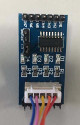

# ULN2003 for ESP32
uln2003 for `MicroPython` has been in github, here's the [link](https://github.com/IDWizard/uln2003). But it's work for `microbit`, so I change a little to transplant for my NodeMCU's `ESP-32s`. Here's the example:
```python
import Stepper
from machine import Pin
s1 = Stepper.create(Pin(16,Pin.OUT),Pin(17,Pin.OUT),Pin(5,Pin.OUT),Pin(18,Pin.OUT), delay=2)
s1.step(100)
s1.step(100,-1)
s1.angle(180)
s1.angle(360,-1)
```
function `angle` is angle, and the PIN map:
`IN1` link `PIN_16`
`IN2` link `PIN_17`
`IN3` link `PIN_5`
`IN4` link `PIN_18`
My uln2003 board like this, and stepper runing:<br />
      <br />